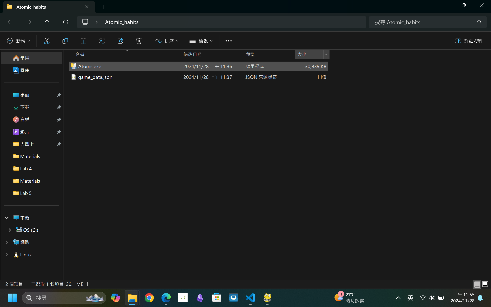
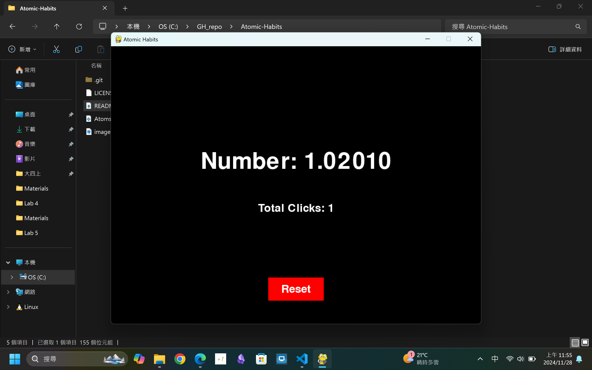

# Atomic-Habits
A simple application written in python that can track or reset your progress at your desire to help your journey on personal development.

## First run the following command to install related libraries:
pip install pyinstaller pygame

## Then run the command at the folder where this .py file resides in:
python -m PyInstaller --onefile -w Atoms.py

This should bundle the .py and related files into a single .exe file, and the build folder and the .spec file is of no use which can be deleted at your disposal.

## Application screenshot

